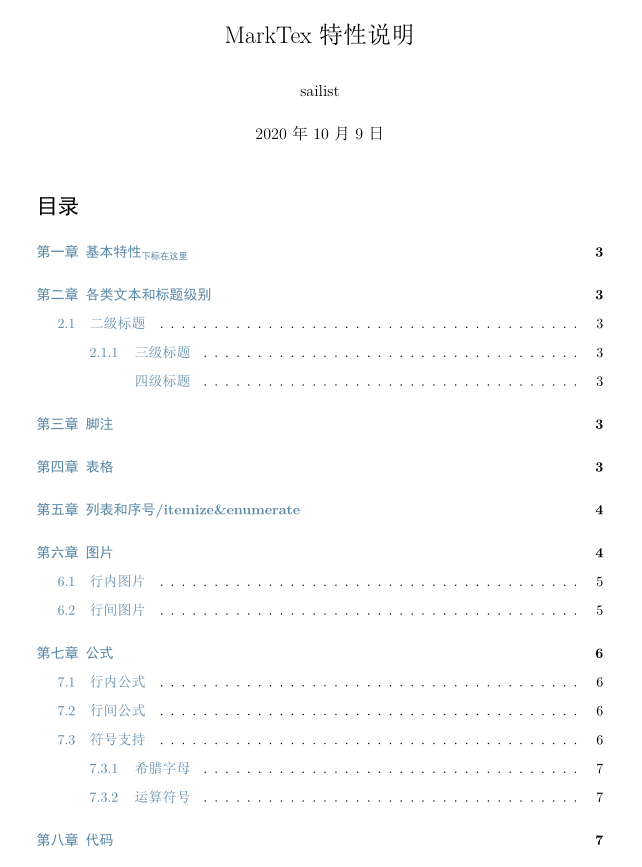
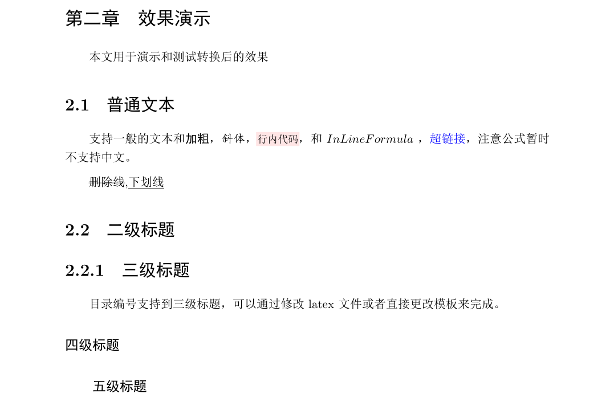
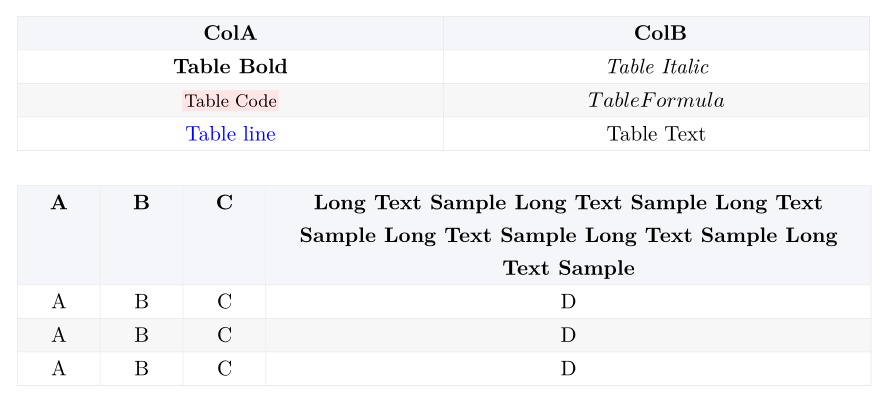
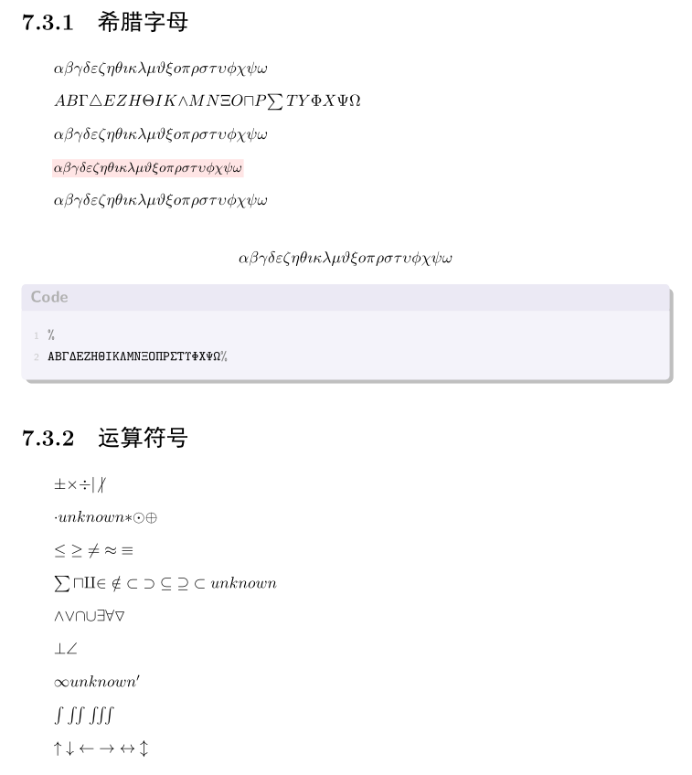
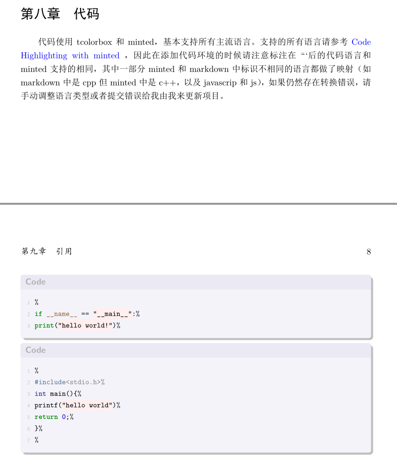
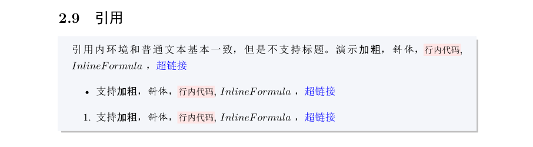
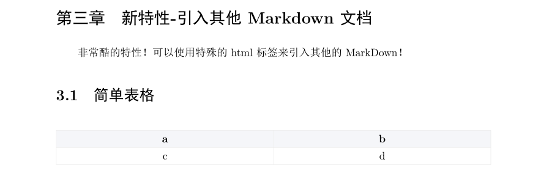
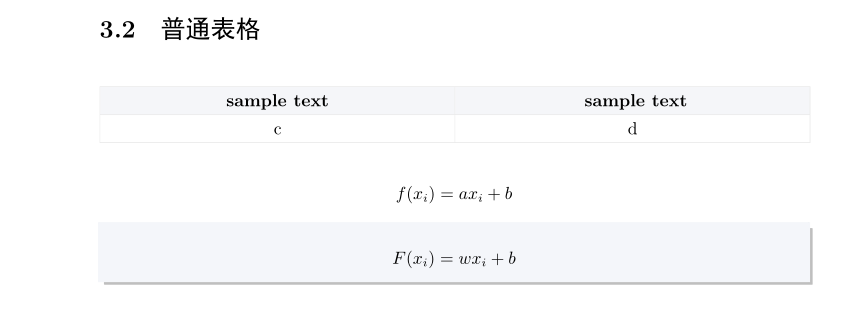

# MarkTex
MarkTex是将Markdown内容转换为Latex文档的Python库，如果熟悉一些LaTeX的话，那么该库应该是当前最好最美观排版最舒适可定制性最强的Markdown转PDF的方案。

# 特性汇总

1. 支持markdown中基本上所有的特性：标题、代码、引用、目录、图片、表格、链接...
1. 图片支持行内图片（会自动调整大小适应一行）和行间图片，支持使用本地相对路径和网络链接，会自动判断下载
2. 表格自动调整列宽，且进行了相关美化，不会变丑
3. 支持通过tex模板文件定制
4. 支持在当前markdown中引入其他markdown和tex文件，实现很方便的协作
5. 公式支持中文啦
6. 支持自定义额外解析串
7. 语法树生成和代码转换完全分离，可以通过语法树自定义转换其他语言。
8. ...

> 最新支持的全部语法可以在[example.md](./marktex/example/example.md)中参考，相应的效果可以查看[all_example.pdf](./outputs/out/all_example.pdf)，README中因为比较麻烦，更新可能不会很及时。

# 使用方式
```bash
pip install marktex
```

```python
from marktex import api
api.convert('mdpath1','mdpath2',...,output_dir='output_dir')
```

目录`outoput/`下的例子可以通过以下代码生成，运行后会生成到程序运行文件的 output 目录下
```python
from marktex.api import run_example
run_example()
```


你也可以通过命令行运行：

输出到对应文件的 "文件名" 所在的目录下：
```bash
marktex a.md b.md ...
```

输出到一个同一的文件夹下：
```bash
marktex a.md b.md ... -o "path"
```

指定输出到各自文件夹，必须保证路径个数和文件个数相同：
```bash
marktex a.md b.md ... -e "pathfora" "pathforb" ...
```
## FQA
**Q: latex 文件所需的编译器是什么？**

A: 生成的 tex 文件使用了 ctex 包和 fontspec 包。所以无法通过 pdflatex、latex 或 lualatex进行编译，因此需要使用 xelatex 才能编译。

**Q: 关于在线编译 PDF**

A: 因为 latex 的编译器太大，安装麻烦，所以可以选择使用 [overleaf](https://www.overleaf.com/) 在线编辑 tex 文件。overleaf 的默认编译引擎是 pdflatex ，无法编译 marktex生成的文件。需要点击左上角的“菜单”图标，修改编译器，选择 xelatex 。


# 特性介绍
具体可以参考[example.md](./marktex/example/example.md)
其pdf输出效果可以参考
[all_example.pdf](./outputs/out/all_example.pdf)

## 目录
```bash
 [toc]
```


## 特性介绍
```bash
# 特性<sub>下标在这里</sub>
- 支持目前主流的所有markdown语法（目前，脚注和xml标签暂时不支持）
- 额外添加了下划线语法（`__下划线__`）
- 表格自动调整列宽
- 复选框支持三种
- 无论是本地图片还是网络图片，都能够支持。
```


## 文字效果与五级标题
```bash
# 效果演示

本文用于演示和测试转换后的效果

## 普通文本
支持一般的文本和**加粗**，*斜体*，`行内代码`，和$InLine Formula$，[超链接](http://github.com)，注意公式暂时不支持中文。

~~删除线~~,__下划线__

## 二级标题

### 三级标题
目录编号支持到三级标题，可以通过修改latex文件或者直接更改模板来完成。

#### 四级标题
##### 五级标题
```



## 表格
可以完美的自适应表格列宽（测试效果良好，不排除特例），不过暂时不支持表格内插入图片
```bash
## 表格
支持一般的文本格式，暂时不支持表格内图片。另外，表格取消了浮动（float），因此不支持对表格的描述（caption），不过在Markdown中也没有对表格的描述，因此也不算功能不完善。

|ColA| ColB |
|--|--|
| **Table Bold** |  *Table Italic*|
| `Table Code` |  $Table Formula$|
|[Table line](www.github.com)|Table Text|

|A|B|C|Long Text Sample Long Text Sample Long Text Sample Long Text Sample Long Text Sample Long Text Sample |
|--|--|--|--|
|A|B|C|D|
|A|B|C|D|
|A|B|C|D|
```


## 列表、序号、复选框
```bash
## 列表和序号/itemize&enumerate
- 支持**加粗**，*斜体*，`行内代码`,$Inline Formula$，[超链接](www.github.com)
- 支持**加粗**，*斜体*，`行内代码`,$Inline Formula$，[超链接](www.github.com)
- 支持**加粗**，*斜体*，`行内代码`,$Inline Formula$，[超链接](www.github.com)

1. 支持**加粗**，*斜体*，`行内代码`,$Inline Formula$，[超链接](www.github.com)
2. 支持**加粗**，*斜体*，`行内代码`,$Inline Formula$，[超链接](www.github.com)
3. 支持**加粗**，*斜体*，`行内代码`,$Inline Formula$，[超链接](www.github.com)

 [x] 支持
 [√] 三种
 [] 复选框格式
```


## 图片
图片支持网络图片和本地图片，会被统一的哈希命名后存放到自定义的图片目录下
```bash
## 图片
和表格一样，取消了浮动，因此暂时不支持对图片的描述。不过本项目支持网络图片，会在转换的时候自动下载到本地。


```


## 公式

公式支持中文，但没有编号，如果要编号可以通过手动添加tag的方式

### 行内公式
$f(x) = x_{1} 中文$ 

### 行间公式
$$
使用函数 f(x_i)=ax_i+b \tag{1} 
$$


### 符号支持
符号集在内部做了一个映射，可以将任意公式内外的符号均映射成为 LaTeX 中的符号。

原本的解决方案为添加一个额外的符号字体集来解决（来自于[stackoverflow](https://tex.stackexchange.com/questions/69901/how-to-typeset-greek-letters) ），目前的方案为两者优先采用映射方法，目前支持的符号列举如下（可能支持更多符号，但没有经过测试）：

#### 希腊字母
αβγδεζηθικλμνξοπρστυφχψω

ΑΒΓΔΕΖΗΘΙΚΛΜΝΞΟΠΡΣΤΥΦΧΨΩ


**αβγδεζηθικλμνξοπρστυφχψω**

`αβγδεζηθικλμνξοπρστυφχψω`

$αβγδεζηθικλμνξοπρστυφχψω$

$$αβγδεζηθικλμνξοπρστυφχψω$$

```
ΑΒΓΔΕΖΗΘΙΚΛΜΝΞΟΠΡΣΤΥΦΧΨΩ
```

#### 运算符号
±×÷∣∤

⋅∘∗⊙⊕

≤≥≠≈≡

∑∏∐∈∉⊂⊃⊆⊇⊄

∧∨∩∪∃∀∇

⊥∠

∞∘′

∫∬∭

↑↓←→↔↕





## 代码

```bash
代码使用tcolorbox和minted，基本支持所有主流语言。支持的所有语言请参考 [Code Highlighting with minted](https://www.overleaf.com/learn/latex/Code_Highlighting_with_minted) 
```
```python
if __name__ == "__main__":
	print("hello world!")
```
```cpp
#include<stdio.h>
int main(){
	printf("hello world")
	return 0;
}
```



## 引用
```bash
## 引用
> 引用内环境和普通文本基本一致，但是不支持标题。
> 演示**加粗**，*斜体*，`行内代码`,$Inline Formula$，[超链接](www.github.com)
> - 支持**加粗**，*斜体*，`行内代码`,$Inline Formula$，[超链接](www.github.com)
> 1. 支持**加粗**，*斜体*，`行内代码`,$Inline Formula$，[超链接](www.github.com)

> 表格：
> |ColA| ColB |
>|--|--|
>| **Table Bold** |  *Table Italic*|
>| `Table Code` |  $Table Formula$|
>|[Table line](www.github.com)|Table Text|
> 公式：
> $$F(x_i) = wx_i+b$$
> 图片：
> 
> 
```



## 新特性
```bash
# 新特性-引入其他Markdown文档

非常酷的特性！可以使用特殊的html标签来引入其他的MarkDown！

<include>./table_example.md</include>

<include>./formula_example.md</include>

```






# 其他
 - [ ] 多级嵌套存在优先级限制，仍然待解决
 - [ ] 列表的缩进支持
 - [ ] 表格列宽度比例的计算方式改进
 - [ ] 添加其他类型的 parser ？